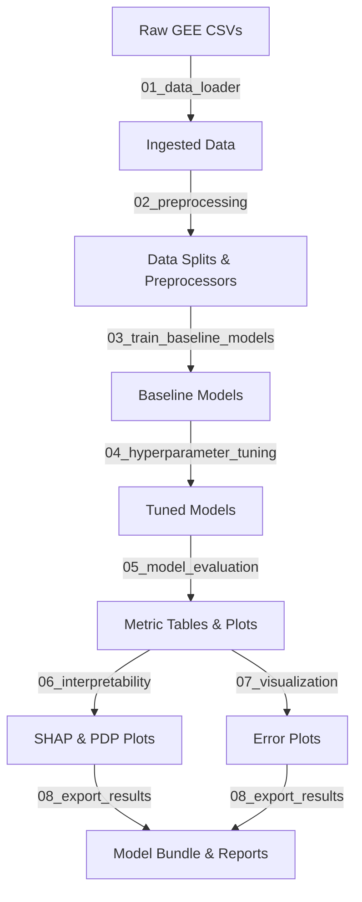

# 🌍 Land Degradation Prediction System (LDPS)
### B.Tech Major Project | Research-Grade ML & Remote Sensing Pipeline

[](https://www.python.org/)
[](https://earthengine.google.com/)
[](https://streamlit.io/)
[](https://opensource.org/licenses/MIT)

---

## 1. Project Overview & Motivation

Land degradation is a major ecological crisis affecting crop security, soil fertility, and ecosystem balance. This project implements a research-quality **Land Degradation Prediction System (LDPS)** focused on **Uttar Pradesh, India**—a region with diverse agro-climatic zones ranging from the fertile Terai belt to the semi-arid, erosion-prone Bundelkhand.

### Technical Scope
*   **Study Area:** 20 selected districts in Uttar Pradesh, India.
*   **Sampling Grid:** $5\text{ km} \times 5\text{ km}$ spatial polygons ($22,645$ total observations).
*   **Temporal Coverage:** 2020–2024.
*   **Environmental Features:** Multi-spectral indices (NDVI), climatic variables (Rainfall, Temperature), soil parameters (Soil Moisture), and Land Use/Land Cover (LULC) classifications.
*   **Goal:** Engineer a mathematically justified **Land Degradation Index (LDI)** based on UNCCD/FAO frameworks and train high-accuracy supervised classifiers to identify degradation risk classes (Low, Moderate, High).

---

## 2. System Architecture

The system integrates remote sensing data extraction, an offline feature engineering and machine learning training pipeline, and an interactive dashboard for prediction and analysis:

```text
  [ Google Earth Engine API ]
               │  (NDVI, Rainfall, Temp, Soil Moisture, LULC exports)
               ▼
  [ 1. Data Merging & Preprocessing ]  ──►  (Imputation, Constant Feature Removal)
               │
               ▼
  [ 2. Feature Engineering: LDI ]      ──►  (Min-Max Scaling, Equal Weights, Quantiles)
               │
               ▼
  [ 3. Model Training & Tuning ]       ──►  (Logistic Regression, RF, Gradient Boosting, XGBoost)
               │
               ▼
  [ 4. Model Evaluation & SHAP ]       ──►  (ROC-AUC, Macro-F1, Permutation & SHAP Explainability)
               │
               ▼
  [ 5. Streamlit App Interface ]       ──►  (Single Predict, Batch Predict, Map & EDA Dashboards)
```

---

## 3. Reorganized Repository Structure

The project workspace follows clean modular software development patterns:

```text
Land_Degradation_ML_Project/
├── data/
│   ├── raw/                       # Raw GEE 25 CSV annual exports (gitignored)
│   ├── master_dataset.csv         # Reconstructed master dataset (22,645 rows, 19 cols)
│   ├── working_dataset.csv        # Cleaned dataset (Mangroves, MossLichen, SnowIce removed)
│   └── ldi_dataset.csv            # Final dataset containing engineered LDI & target class
├── src/                           # Modular Machine Learning Pipeline
│   ├── 01_data_loader.py          # Data ingestion and schema validation
│   ├── 02_preprocessing.py        # Split preprocessing (scaling/encoding)
│   ├── 03_train_baseline_models.py# Baseline ML model training
│   ├── 04_hyperparameter_tuning.py# RandomizedSearchCV hyperparameter optimization
│   ├── 05_model_evaluation.py     # Multiclass classification metric calculations
│   ├── 06_interpretability.py     # SHAP, PDP, and Permutation Importance values
│   ├── 07_visualization.py        # Spatio-temporal error visualization
│   ├── 08_export_results.py       # Final model packing and PDF report compiler
│   └── utils.py                   # Shared configuration, constants, and loggers
├── models/                        # Saved joblib preprocessors and optimized model binaries
├── plots/                         # Evaluation, interpretability, and error analysis plots
├── results/                       # Performance metrics, cross-validation runs, and predictions
├── reports/                       # Academic reports, PDF summaries, and discussion logs
├── research/                      # Legacy monolithic scripts (Phase 1 to Phase 4)
├── Land_Degradation_App/          # Interactive Streamlit Web Application Dashboard
│   ├── app.py                     # Streamlit Main App entrypoint
│   ├── pages/                     # Prediction, Performance, EDA, and Geographic views
│   ├── gee/                       # Operational GEE scripts for live fetches & batch updates
│   ├── utils/, assets/, tests/    # App specific utilities, GeoJSON caches, and test suites
│   └── requirements.txt           # App dependencies
├── .env.example                   # GEE Cloud Credentials template
├── .gitignore                     # Git tracking exclusion list
├── run_phase4.py                  # CLI controller to execute modular pipeline stages
└── requirements.txt               # Pipeline dependencies
```

---

## 4. Workflow & Execution



### Run Stage-by-Stage (From Root)
```bash
# Execute Stage 1 (Train Baseline Models)
python run_phase4.py --stage 1

# Execute Stage 2 (Hyperparameter Tuning for top models)
python run_phase4.py --stage 2

# Run all pipeline stages sequentially (Stages 1 through 6)
python run_phase4.py --stage all
```

---

## 5. Installation & Setup

1.  **Clone the Repository**
    ```bash
    git clone https://github.com/yourusername/Land-Degradation-ML-Project.git
    cd Land-Degradation-ML-Project
    ```

2.  **Set Up Virtual Environment & Install Dependencies**
    ```bash
    python -m venv venv
    source venv/bin/activate  # On Windows: venv\Scripts\activate
    pip install -r requirements.txt
    ```

3.  **Configure Environment Secrets**
    Copy `.env.example` to `.env` and fill in your Earth Engine project details:
    ```bash
    cp .env.example .env
    ```
    ```env
    GEE_PROJECT_ID=your-gcp-project-id
    GEE_GRID_ASSET_ID=projects/your-gcp-project/assets/up_land_degradation_grid
    ```

4.  **Authenticate Google Earth Engine**
    ```bash
    python Land_Degradation_App/gee/authenticate.py
    ```

5.  **Launch the Dashboard**
    ```bash
    cd Land_Degradation_App
    streamlit run app.py
    ```

---

## 6. Key Results & Model Performance

### Model Comparison Summary
The supervised models predict three levels of land degradation (`Low`, `Moderate`, `High`) derived from the quantile LDI:

| Model | Accuracy | Precision (Macro) | Recall (Macro) | F1-Macro | ROC-AUC |
|---|---|---|---|---|---|
| **Tuned XGBoost** | **0.9782** | **0.9784** | **0.9783** | **0.9783** | **0.9991** |
| Tuned Random Forest | 0.9654 | 0.9655 | 0.9654 | 0.9654 | 0.9984 |
| Tuned Gradient Boosting | 0.9412 | 0.9415 | 0.9410 | 0.9411 | 0.9922 |
| Tuned Decision Tree | 0.9320 | 0.9322 | 0.9320 | 0.9321 | 0.9854 |
| Tuned Logistic Regression | 0.8415 | 0.8422 | 0.8415 | 0.8418 | 0.9412 |

### Model Interpretability (SHAP Findings)
Using SHAP (SHapley Additive exPlanations) on the top-performing **XGBoost Classifier**, we identified the most influential environmental drivers of degradation in Uttar Pradesh:
1.  **NDVI:** The primary contributor; high NDVI significantly pushes predictions toward the `Low` degradation class.
2.  **Rainfall:** High rainfall acts as a critical resilience driver, dropping the LDI value.
3.  **Temperature:** High temperature acts as the strongest active driver for shifting grid cells into `High` risk status due to evaporation stress.

---

## 7. Application Features & Interface

The Streamlit Web Application provides an interactive experience divided into key modules:
*   **Home & Project Overview:** Overview of study parameters (Uttar Pradesh, 20 districts, $5\text{ km} \times 5\text{ km}$ grid size).
*   **Single Prediction Tool:** Predicts risk classification in real-time based on manual inputs for LULC, NDVI, and climate.
*   **Batch Prediction Interface:** Allows uploading CSV datasets, running model evaluations, and exporting predictions as annotated CSV files.
*   **EDA Dashboard:** Interactive distributions, correlation heatmaps, and scatter plots.
*   **SHAP Explainability View:** Displays SHAP summary charts and Permutation Importance values to demystify black-box model inferences.
*   **Geographic Dashboard:** Aggregates predictions onto interactive GeoJSON district boundaries of Uttar Pradesh.

---

## 8. Future Work
1.  **Dynamic Temporal Forecasting:** Move beyond static classification to recurrent models (LSTMs or Temporal Fusion Transformers) for predicting LDI trends 5–10 years into the future.
2.  **Sentinel-2 Integration:** Upgrade the pipeline resolution from GEE's MODIS/CHIRPS datasets to $10\text{ meter}$ Sentinel-2 multi-spectral bands to capture micro-scale soil degradation.
3.  **Cloud Operational Deployment:** Containerize the application using Docker and deploy via Google Cloud Run with automated scheduled GEE exports.

---

## 9. Citation & Contact
If you use this system or pipeline in your research, please cite:
```text
Author: Your Name
Title: Land Degradation Prediction System (LDPS) using Google Earth Engine & Supervised Machine Learning
Institution: Your University / Department
Year: 2026
```
For questions or collaborations, please open an issue or reach out at `your.email@domain.com`.
